# Analysis of Spatially Correlated Bike Sharing Demand in New York City
Project for Bayesian Statistics course @polimi 2019/2020

Aurelio Marin, Edoardo Peretti, Luca Pirazzini

### Structure of the folders
* report: contains the project report
* *script*: contains all the R scripts
  * *data*: contains all the used data
  * *maps*: contains shapefiles useful for plotting
  * *data_preproc.R*: data loading, cleaning, preparation and preliminary tests and exploratory analysis
  * *models.R*: models specification, fitting and testing
  * *utils.R*: some utility functions
* *img*: contains images for the readme

### A note on packages

All the models are fitted with *spBayes* R package. For the complete list of packages required see the scripts. Please note that currently the *spTest* package is no more available on the CRAN repository: you can download it from the archive at this [link](https://cran.r-project.org/src/contrib/Archive/spTest/). All the other packages are easily installable from the CRAN repository.

## Introduction
In this project we analyze the demand of bikes in each station of the CitiBike bike sharing system of New York City. Currently, CitiBike includes more than 700 stations distributed in Manhattan, Brooklyn and Queens. In our work, we have restricted the focus on Manhattan, as data were easier to retrieve and the area covered seems to be large enough to capture interesting effects.

The main variable of interest, in the course of the analysis, will be the number of trips departing a specific station, or simply **demand** from a station. The data used on this are relative to the month of November, 2017. The following figure shows the distribution of the demand in Manhattan.
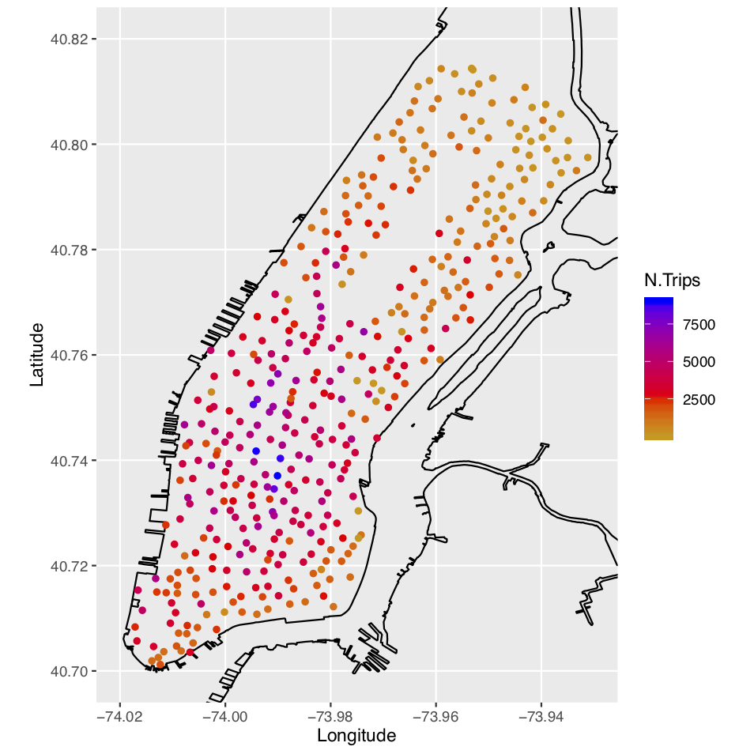

## Geostatistical model

We employ a Bayesian Point-Referenced Regression model to analyze the data. The observed demand *Y* at location ***s***i is described as

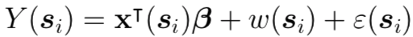

where **x**T(**s**i) is a vector of spatially referenced predictors, w(**s**i) is a residual stationary spatial process and &epsilon;(**s**i) is the pure error term. In particular we assume a Gaussian response and an intrinsic stationary stochastic spatial process with exponential covariance. Summing up, along with the parameters priors, our model is the following:

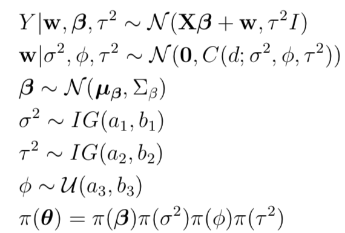

where the covariance of the gaussian spatial process is the exponential one.

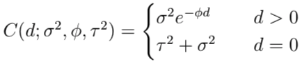

#### Priors
The prior hyperparameters are set as follows:
* a1=a2=2
* b1 proportion of residual variance from the spatial process w
* b2  proportion of residual variance from the non-spatial process &epsilon;
* a3= -log(0.05)/max_dist
* b3= -log(0.05)/min_dist

where max_dist and min_dist are the largest and smallest existing distance in the dataset

#### Predictors
The predictors use in the regression analysis are the following:
* **Population**: value provided for population according to 2010 Census to the block where a station is located
* **Bike lanes** : number of bike lanes segments (as a quantitative measure) located within a range of 500 m from a station
* **Subway**: distance to the closest subway access from a station
* **Landmarks**: for each station, distance to the closest landmark (Central Park, Times Square, Empire State Building, Rockfeller Center, Brooklyn Bridge, High Line, Metropolitan Museum, OneWorld Trade Center)
* **Proximity** : a score assigned to each station based on the sum of the square inverse distances from the other stations

As shown by the following figure, the predicors are reasonably uncorrelated.
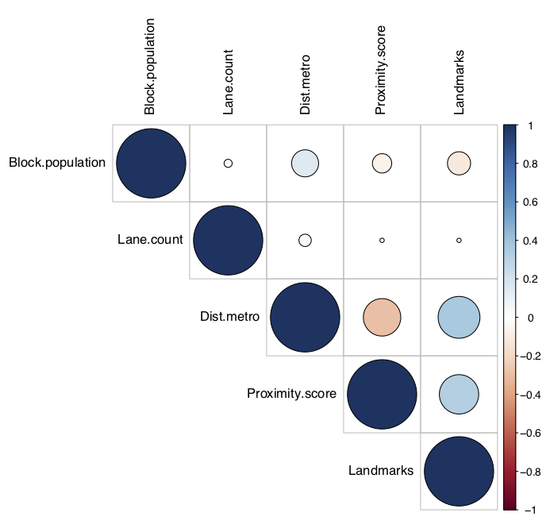

#### Model variants
Changing the number of predictors considered, we define 4 models as shown by the following table.
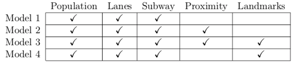

We also fit these models with two different training sets as shown in the following figures.
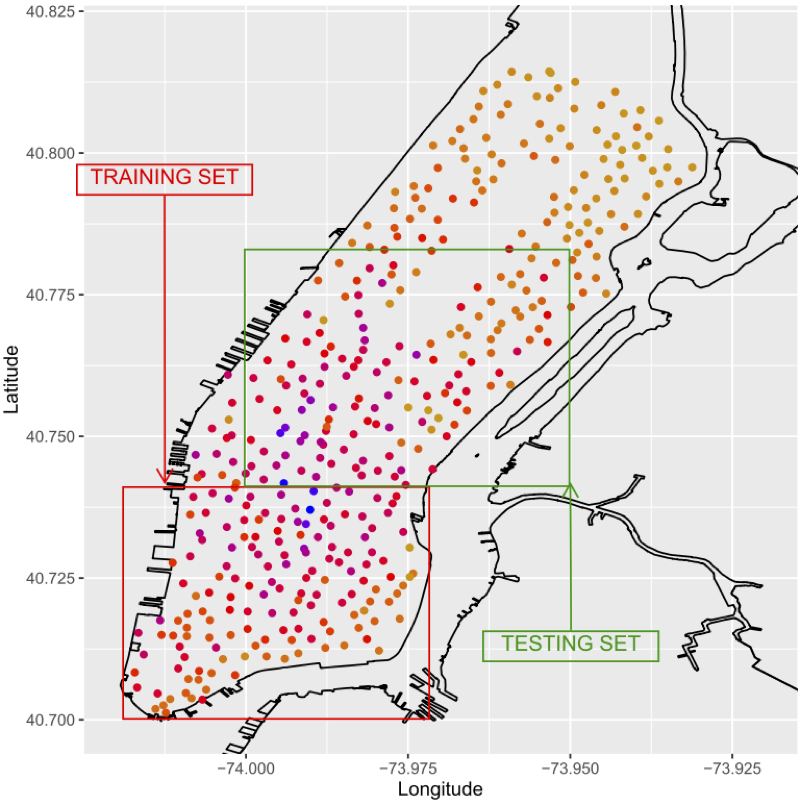
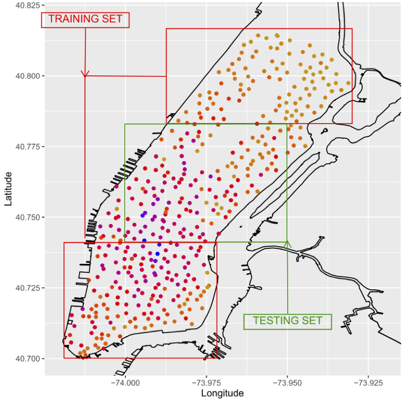

#### Models comparison
We compare the models by means of some predictive goodness of fit criteria
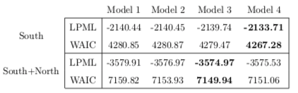

## Results
The posteriors of the models are extensively analyze. Some plots are anticipated here.
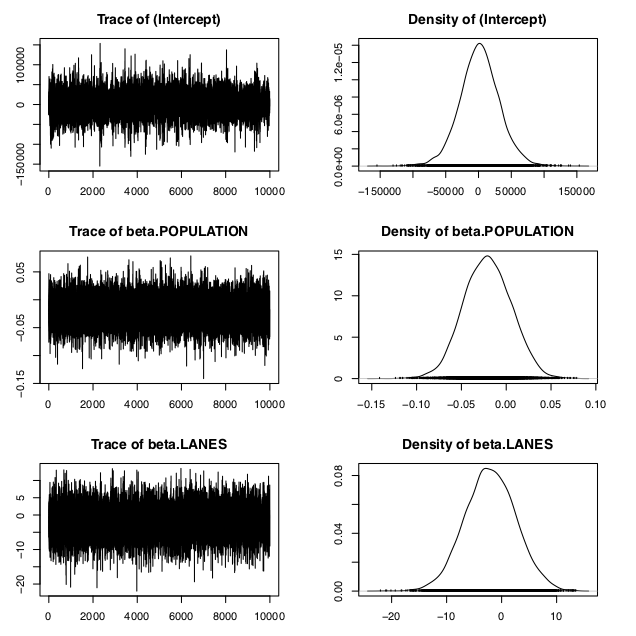
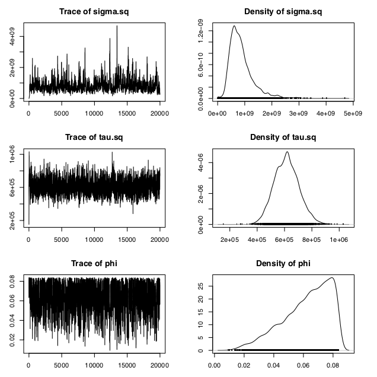
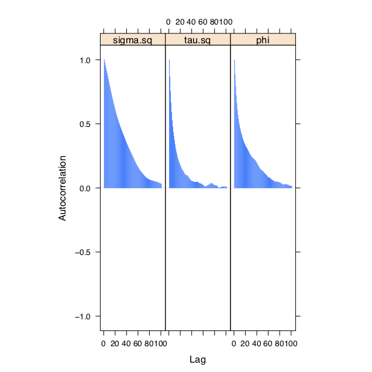

## Prediction
The prediction is performed in the central area of Manhattan. The following plots show the (smoothed) observed demand and the one of the predictions.

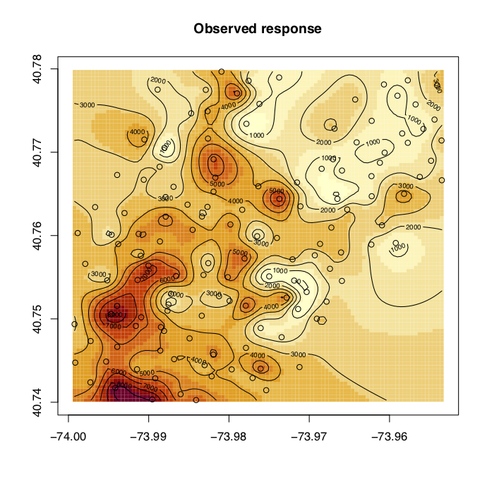
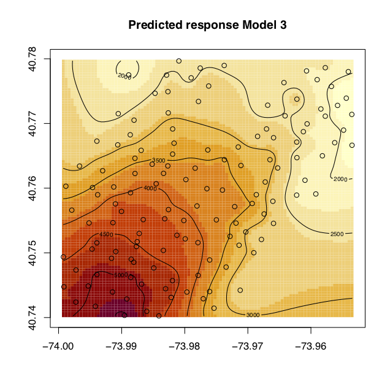

For a more thoroughly discussion, more plots and all the references, please refer to the project report.
